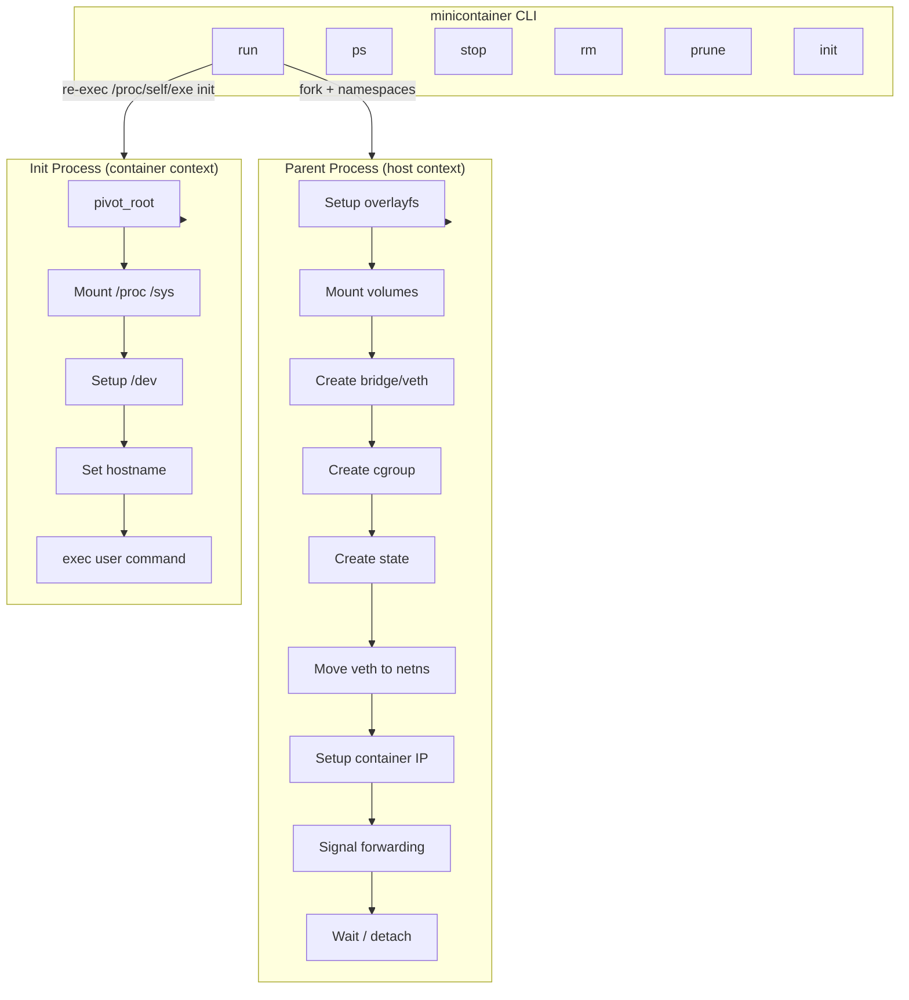

# MiniContainer

[](https://github.com/hwang-fu/minicontainer/actions/workflows/ci.yml)
[](https://go.dev/)
[](LICENSE)
[](https://kernel.org/)


> A minimal Linux container runtime written in Go for educational purposes.

MiniContainer implements the core primitives that power Docker and other container systems: **namespaces**, **cgroups**, **overlayfs**, and **networking** — all from scratch, with minimal dependencies.

---

## Why MiniContainer?

- **Learn by building** — Understand containers at the syscall level
- **Minimal dependencies** — Only Go stdlib + `golang.org/x/sys/unix`
- **Clean codebase** — Well-documented, easy to follow
- **Real isolation** — Not a toy; uses the same primitives as Docker

---

## Container Technology: Orchestration, Not Invention (Some of My Personal Opinions)

Container technology is essentially a clever packaging of several pre-existing Linux kernel features:

| Capability | Underlying Linux Technology |
|------------|----------------------------|
| Process isolation | **namespaces** (PID, network, mount, user, etc.) |
| Resource limiting | **cgroups** (control groups) |
| Layered filesystem | **OverlayFS / AUFS** |
| Root directory isolation | **chroot / pivot_root** |

All of these technologies existed long before Docker or any modern container runtime came along. You can even manually stitch together these primitives to create a "poor man's container":

```bash
# Create an isolated namespace and run bash inside it
unshare --mount --uts --ipc --net --pid --fork bash
```

### The Real Value of Container Tooling

The innovation isn't in the technology itself — it's in the **abstraction and developer experience (DX)**:

- Wrapping complex kernel APIs into simple commands like `docker run` or `podman run`
- Defining a standard image format and declarative build syntax (Dockerfile, OCI spec)
- Building ecosystem infrastructure like registries (Docker Hub, GitHub Container Registry)

It's similar to how Git didn't invent "version control" as a concept, but elegantly combined snapshots, DAGs, and content-addressable storage into something that just *works*.

> **The insight:** Container technology is orchestration, not invention. The real heavy lifting is done by the Linux kernel.

This is also why containers only run natively on Linux — on macOS and Windows, container runtimes actually spin up a hidden Linux VM under the hood.

---

## Features

| Category | Features |
|----------|----------|
| **Namespaces** | UTS, PID, IPC, Mount, User, Network (all 6 Linux namespaces) |
| **Filesystem** | `pivot_root`, overlayfs (COW), volume mounts, `/proc`, `/sys`, `/dev` |
| **Networking** | Bridge (`minicontainer0`), veth pairs, IPAM, NAT, port publishing (`-p`) |
| **Resource Limits** | Cgroups v2: memory (`--memory`), CPU (`--cpus`), pids (`--pids-limit`) |
| **Images** | Pull from Docker Hub, import tarballs, content-addressable layers |
| **Lifecycle** | Container IDs, state persistence, `ps`, `stop`, `rm` |
| **Terminal** | PTY allocation (`-it`), signal forwarding |
| **Modes** | Interactive, non-interactive, detached (`-d`) |

### CLI Commands

```
minicontainer run [flags] <image|--rootfs> <cmd>  Run a container
minicontainer pull <image>                        Pull image from registry
minicontainer ps [-a]                             List containers
minicontainer stop <container>                    Stop a running container
minicontainer rm <container|--all>                Remove stopped containers
minicontainer import <tarball> <name[:tag]>       Import tarball as image
minicontainer images                              List local images
minicontainer rmi <image>                         Remove an image
minicontainer prune                               Clean stale overlay directories
minicontainer version                             Show version
```

### Run Flags

| Flag | Description |
|------|-------------|
| `--rootfs PATH` | Container root filesystem (optional if using image) |
| `--name NAME` | Container name |
| `--hostname NAME` | Container hostname |
| `-d` | Detached mode (background) |
| `-i` | Interactive (keep stdin open) |
| `-t` | Allocate pseudo-TTY |
| `-e KEY=VAL` | Set environment variable |
| `-v HOST:CONTAINER[:ro]` | Bind mount volume |
| `--memory SIZE` | Memory limit (e.g., `256m`, `1g`) |
| `--cpus N` | CPU limit (e.g., `0.5`, `2`) |
| `--pids-limit N` | Max number of processes |
| `-p HOST:CONTAINER` | Publish container port to host |

---

## Quick Start

### 1. Build

```bash
make build
```

### 2. Get a rootfs

```bash
wget https://dl-cdn.alpinelinux.org/alpine/v3.19/releases/x86_64/alpine-minirootfs-3.19.0-x86_64.tar.gz
mkdir -p /tmp/alpine-rootfs
tar -xzf alpine-minirootfs-3.19.0-x86_64.tar.gz -C /tmp/alpine-rootfs
```

### 3. Run a container

```bash
# Interactive shell
sudo ./minicontainer run -it --rootfs /tmp/alpine-rootfs /bin/sh

# Run a command
sudo ./minicontainer run --rootfs /tmp/alpine-rootfs /bin/echo "Hello from container!"

# Detached mode
sudo ./minicontainer run -d --rootfs /tmp/alpine-rootfs /bin/sleep 60
sudo ./minicontainer ps
sudo ./minicontainer stop <id>

# With resource limits
sudo ./minicontainer run -it --memory 256m --cpus 0.5 --pids-limit 50 \
    --rootfs /tmp/alpine-rootfs /bin/sh
```

### 4. Pull from Docker Hub (recommended)

```bash
# Pull an image
sudo ./minicontainer pull alpine

# List images
sudo ./minicontainer images

# Run from pulled image
sudo ./minicontainer run -it alpine /bin/sh

# Remove image
sudo ./minicontainer rmi alpine
```

### 5. Import local tarball (alternative)

```bash
# Import tarball as image
sudo ./minicontainer import alpine-minirootfs-3.19.0-x86_64.tar.gz alpine:3.19

# Run from imported image
sudo ./minicontainer run -it alpine:3.19 /bin/sh
```

### Inside the container

```
/ # hostname
minicontainer

/ # ps aux
PID   USER     TIME  COMMAND
    1 root      0:00 /bin/sh
    7 root      0:00 ps aux

/ # ls /dev
null  random  tty  urandom  zero

/ # ip addr show eth0
26: eth0@if27: <BROADCAST,MULTICAST,UP,LOWER_UP> ...
    inet 172.18.0.2/16 scope global eth0

/ # ping -c 2 8.8.8.8
PING 8.8.8.8 (8.8.8.8): 56 data bytes
64 bytes from 8.8.8.8: seq=0 ttl=113 time=35.1 ms
64 bytes from 8.8.8.8: seq=1 ttl=113 time=34.2 ms

/ # exit
```

---

## Architecture



### Project Structure

```
minicontainer/
├── main.go                 # Entry point, CLI routing
├── cmd/
│   ├── config.go           # ContainerConfig, flag parsing
│   ├── init.go             # Init process (runs inside namespaces)
│   └── commands.go         # stop, rm, ps, prune commands
├── container/
│   ├── id.go               # Container ID generation (SHA256)
│   ├── runtime.go          # ContainerRuntime (shared lifecycle)
│   └── run.go              # Run modes (TTY, non-TTY, detached)
├── cgroup/
│   └── cgroup.go           # Cgroups v2 resource limits
├── network/
│   ├── bridge.go           # Bridge creation (minicontainer0)
│   ├── veth.go             # Veth pair creation and management
│   ├── ipam.go             # IP address allocation
│   ├── setup.go            # Container network configuration
│   ├── nat.go              # NAT/masquerade for internet access
│   └── port.go             # Port publishing (iptables DNAT)
├── runtime/
│   └── pty.go              # PTY allocation, raw terminal mode
├── fs/
│   ├── cleanup.go          # Stale overlay cleanup
│   ├── dev.go              # /dev tmpfs and device nodes
│   ├── overlay.go          # Overlayfs mount/unmount
│   └── volume.go           # Volume bind mounts
├── state/
│   └── container.go        # State persistence (JSON)
├── image/
│   ├── storage.go          # Image/layer directory paths
│   ├── metadata.go         # ImageMetadata struct, save/load
│   ├── layer.go            # Layer extraction and management
│   ├── import.go           # Tarball import
│   ├── lookup.go           # Image lookup for run
│   ├── list.go             # List all images
│   ├── remove.go           # Remove image and layers
│   ├── reference.go        # Image reference parsing
│   ├── registry.go         # Registry client and authentication
│   └── pull.go             # Pull images from registries
└── Makefile
```

---

## Roadmap

- [x] **Phase 1**: Minimal isolation (namespaces, chroot)
- [x] **Phase 2**: Proper filesystem (pivot_root, overlayfs, volumes)
- [x] **Phase 3**: Container lifecycle (ps, stop, rm, detached mode)
- [x] **Phase 4**: Resource limits (cgroups v2: memory, CPU, pids)
- [x] **Phase 5**: Networking (veth, bridge, NAT, port publishing)
- [x] **Phase 6**: OCI images (import, images, rmi, run from image)
- [x] **Phase 7**: Registry pull (Docker Hub, multi-arch support)
- [ ] **Phase 8**: Polish (logs, exec, inspect)

---

## Requirements

- **Linux** kernel 4.x+ (cgroups v2 recommended)
- **Go** 1.24+
- **Root access** (sudo) for container operations

---

## Development

```bash
make build      # Build binary
make check      # Run fmt, vet, build
make test       # Run tests (requires root)
make clean      # Clean build artifacts
```

---

## Author

**Junzhe Wang**

- junzhe.hwangfu@gmail.com — bug reports, contributions
- junzhe.wang2002@gmail.com — job opportunities, collaboration

---

## License

MIT License — see [LICENSE](LICENSE) for details.
